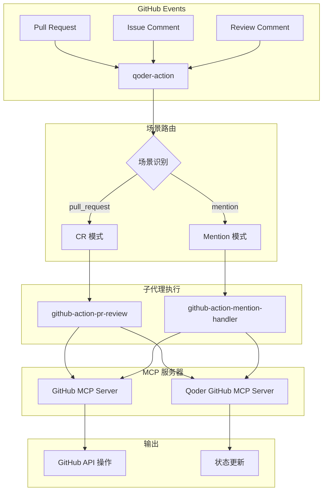
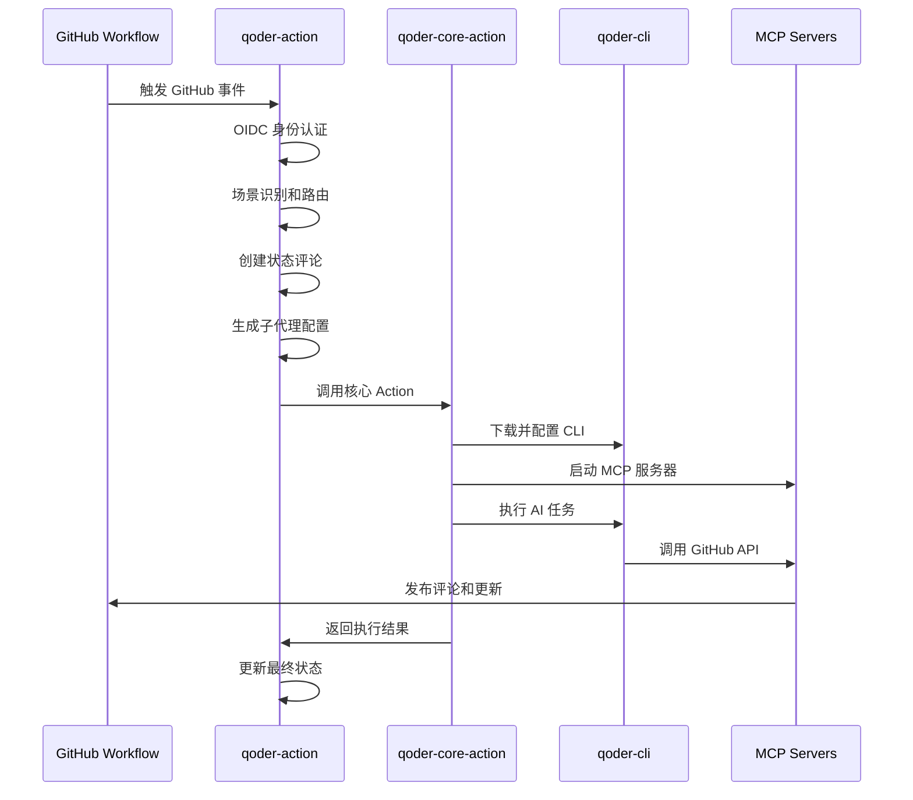

# Qoder Action

[](https://github.com/wenxinax/qoder-action/blob/main/LICENSE)
[](https://github.com/wenxinax/qoder-action/stargazers)
[](https://github.com/wenxinax/qoder-action/issues)

**基于 Qoder CLI 的智能 GitHub Action 框架**

Qoder Action 提供基于场景的 AI 代码助手功能，支持自动代码审查和智能问答交互。通过专门的子代理系统和 MCP 服务器集成，在 GitHub 工作流中提供专业的代码分析和技术支持。

---

## ✨ 主要功能

### 🔍 代码审查模式 (CR)
- 自动分析 Pull Request 中的代码变更
- 提供行间评论和完整的审查报告
- 实时进度追踪和状态更新
- 支持多维度代码质量检查

### 💬 智能问答模式 (Mention)
- 响应评论中的 @qoder 提及
- 支持技术问题解答和代码解释
- 理解上下文和对话线程
- 提供专业的技术建议

### 🔐 安全认证
- 基于 GitHub App 和 OIDC 的身份验证
- 自动管理访问令牌，无需手动配置
- 符合企业安全标准

---

## 🚀 快速开始

### 1. 安装 GitHub App

在您的仓库或组织中安装 Qoder GitHub App：

1. 访问 [Qoder GitHub App](https://github.com/apps/qoder-app)
2. 点击 "Install" 并选择要安装的仓库
3. 授予必要的权限

### 2. 配置认证信息

在 GitHub 仓库的 Settings → Secrets and variables → Actions 中添加：
- `QODER_USER_INFO`：您的 Qoder 用户信息
- `QODER_MACHINE_ID`：您的机器标识

### 3. 创建工作流文件

根据需要选择以下配置：

#### 自动代码审查

复制 [`examples/qoder-auto-review.yaml`](examples/qoder-auto-review.yaml) 到 `.github/workflows/` 目录：

```yaml
name: "Qoder Auto Review"

on:
  pull_request:
    types: [opened, reopened, synchronize]

jobs:
  auto-review:
    runs-on: ubuntu-latest
    permissions:
      contents: read
      pull-requests: read
      id-token: write
    steps:
      - name: "Checkout"
        uses: actions/checkout@v4

      - name: "Run Qoder Auto Review"
        uses: wenxinax/qoder-action@dev
        with:
          scene: cr
          qoder_user_info: ${{ secrets.QODER_USER_INFO }}
          qoder_machine_id: ${{ secrets.QODER_MACHINE_ID }}
          append_prompt: |
            请使用中文输出结果。
```

#### 智能问答助手

复制 [`examples/qoder-mention.yaml`](examples/qoder-mention.yaml) 到 `.github/workflows/` 目录：

```yaml
name: Qoder Mention

on:
  issue_comment:
    types: [created]
  pull_request_review_comment:
    types: [created]

jobs:
  qoder-mention:
    if: contains(github.event.comment.body, '@qoder')
    runs-on: ubuntu-latest
    permissions:
      contents: read
      pull-requests: read
      issues: read
      id-token: write
    steps:
      - name: Checkout repository
        uses: actions/checkout@v4

      - name: Qoder Action
        uses: wenxinax/qoder-action@dev
        with:
          scene: mention
          qoder_user_info: ${{ secrets.QODER_USER_INFO }}
          qoder_machine_id: ${{ secrets.QODER_MACHINE_ID }}
```

---

## ⚙️ 配置参数

### 输入参数

| 参数名 | 描述 | 必需 | 默认值 | 示例 |
|--------|------|------|--------|------|
| `scene` | 执行场景：`cr`（代码审查）、`mention`（问答）、`custom`（自定义） | ✅ | `cr` | `cr` |
| `append_prompt` | 附加到内置提示的自定义指令 | ❌ | - | `请使用中文输出结果` |
| `prompt` | 自定义任务描述（仅 custom 模式） | ❌ | - | - |
| `qoder_user_info` | Qoder 用户认证信息 | ✅ | - | `${{ secrets.QODER_USER_INFO }}` |
| `qoder_machine_id` | 机器标识 | ✅ | - | `${{ secrets.QODER_MACHINE_ID }}` |

### 权限要求

```yaml
permissions:
  contents: read       # 读取代码内容
  pull-requests: read  # 读取 PR 信息（CR 模式需要 write 权限用于评论）
  issues: read         # 读取 Issue 信息（Mention 模式需要 write 权限用于评论）
  id-token: write      # OIDC 身份验证
```

---

## 📋 工作原理

### 系统架构



### 执行流程

1. **初始化阶段**：OIDC 认证、场景识别、环境配置
2. **执行阶段**：运行 qoder-cli 和 MCP 服务器，执行具体任务
3. **完成阶段**：更新状态、处理结果、清理资源

---

## 🔍 使用场景

### 代码审查 (CR 模式)

**功能特点：**
- 自动分析 Pull Request 代码变更
- 在具体代码行发表评论
- 提供完整的审查总结
- 实时显示审查进度

**配置示例：**
```yaml
with:
  scene: "cr"
  append_prompt: |
    特别关注：
    - 性能优化机会
    - 安全漏洞检查
    - 单元测试覆盖
```

### 智能问答 (Mention 模式)

**功能特点：**
- 响应 @qoder 提及
- 理解代码上下文
- 支持多轮对话
- 提供技术解答

**使用方法：**
在 PR 或 Issue 评论中提及 @qoder：
```
@qoder 这段代码的时间复杂度如何？
@qoder 有更好的实现方式吗？
@qoder 这个函数应该如何测试？
```

---

## 🏗️ 项目架构

### 双层设计理念

Qoder Action 采用分层架构设计，将功能拆分为两个独立的 Action：

#### 🎯 qoder-action (编排层)
作为用户工作流的直接入口，负责整个流程的编排和调度：

**核心职责：**
- **场景识别与路由**：根据 GitHub 事件类型自动识别执行场景
- **身份认证管理**：通过 OIDC 获取和管理 GitHub 访问令牌
- **环境准备**：配置 Git 环境、MCP 服务器、子代理等
- **状态追踪**：创建和更新 GitHub 评论，提供实时进度反馈
- **流程控制**：协调整个工作流的执行和异常处理

#### ⚙️ qoder-core-action (执行层)
封装所有与 qoder-cli 相关的核心任务，是一个纯粹的"执行器"：

**核心职责：**
- **CLI 管理**：下载、配置和运行 qoder-cli
- **容器编排**：启动和管理 MCP 服务器 Docker 容器
- **任务执行**：执行具体的 AI 分析和处理任务
- **结果处理**：捕获和格式化 CLI 输出结果

### 双层架构设计

1. **关注点分离**：编排逻辑与执行逻辑解耦，各司其职
2. **复用性**：qoder-core-action 可以被其他高级用户独立使用
3. **可维护性**：两层独立开发、测试和部署，降低复杂度
4. **灵活性**：支持不同场景的个性化编排而不影响核心执行逻辑

### 项目结构

```
qoder-action/                    # 主 Action (编排层)
├── src/
│   ├── dispatcher.ts           # 任务分发和场景路由
│   ├── finalize.ts             # 状态更新和资源清理
│   └── prompts/                # 提示词系统
│       ├── cr.ts               # 代码审查提示词
│       ├── mention.ts          # 问答助手提示词
│       └── custom.ts           # 自定义任务提示词
├── qoder-core-action/          # 核心 Action (执行层)
│   ├── src/main.ts             # 主执行逻辑
│   ├── action.yml              # 核心 Action 配置
│   └── package.json            # 独立的依赖管理
├── examples/                   # 工作流配置示例
│   ├── qoder-auto-review.yaml  # 自动代码审查配置
│   └── qoder-mention.yaml      # 智能问答配置
└── action.yml                  # 主 Action 配置文件
```

### 执行流程



### Git Subtree 管理

本项目使用 `git subtree` 来管理 `qoder-core-action`：

- **统一开发**：在主仓库中统一开发两个 Action
- **独立发布**：qoder-core-action 作为独立仓库发布
- **版本同步**：确保两层 Action 的版本一致性

```bash
# 推送 core action 更新到独立仓库
git subtree push --prefix=qoder-core-action origin-core main

# 从独立仓库拉取更新
git subtree pull --prefix=qoder-core-action origin-core main --squash
```

---

## 🛠️ 高级配置

### 自定义配置

可通过 `append_prompt` 参数添加特定需求：

```yaml
append_prompt: |
  请关注以下方面：
  - 数据库查询性能
  - API 错误处理
  - 日志记录规范
  - 文档完整性
```

---

## 💡 最佳实践

### 代码审查配置建议

1. **明确审查重点**：通过 `append_prompt` 指定关注领域
2. **触发时机**：建议在 `opened`、`synchronize` 事件触发
3. **权限设置**：确保有 `pull-requests: write` 权限
4. **团队协作**：结合人工审查，发挥各自优势

### 智能问答使用技巧

1. **问题明确**：描述具体的技术问题
2. **提供上下文**：在相关代码行或文件中提问
3. **分步讨论**：复杂问题可通过多轮对话解决
4. **问题分类**：区分技术实现、架构设计、最佳实践等不同类型

### 常见问题排查

- **认证失败**：检查 GitHub App 安装和 Secrets 配置
- **权限不足**：确认工作流权限设置正确
- **触发条件**：验证事件类型和条件表达式
- **网络问题**：检查 Docker 镜像拉取和 MCP 服务器连接

---

<div align="center">

Made with ❤️ by the Qoder Team

</div>
